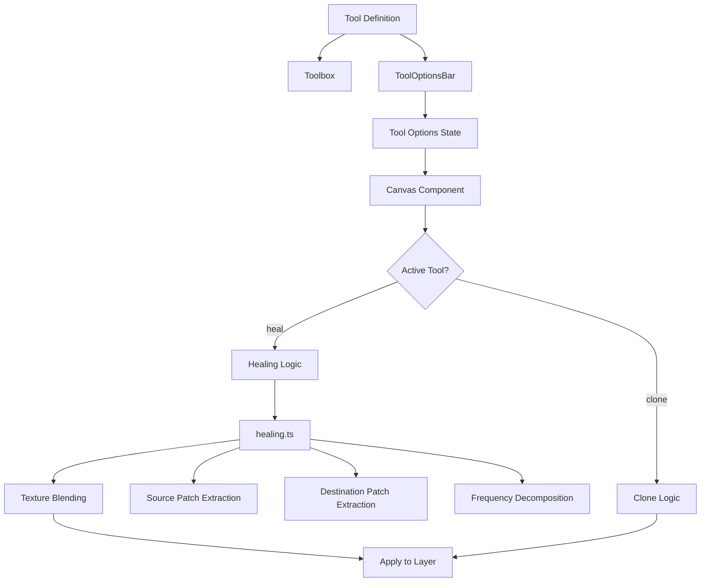

# Healing Brush Tool - Feasibility Report

## Executive Summary

**Feasibility: HIGH** - The Healing Brush tool can be implemented with moderate effort by leveraging the existing Clone Stamp infrastructure and adding texture-blending algorithms.

---

## 1. What is a Healing Brush?

A Healing Brush is a photo retouching tool that:

1. **Samples pixels** from a source location (like Clone Stamp)
2. **Copies pixels** to a destination area
3. **Automatically blends** the copied pixels with the surrounding area to match:
   - Texture
   - Lighting
   - Color/shading

Unlike Clone Stamp which does a direct pixel copy, Healing Brush performs **texture synthesis** to seamlessly blend the source with the destination.

---

## 2. Current Architecture Analysis

### 2.1 Existing Clone Stamp Implementation

The app already has a robust Clone Stamp tool that provides 80% of the needed infrastructure:

| Component | File | Reusability |
|-----------|------|--------------|
| Tool Definition | [`src/data/tools.ts`](src/data/tools.ts:48) | High - add new tool entry |
| Clone Source State | [`src/components/EditorContext.tsx`](src/components/EditorContext.tsx:139) | High - reuse `cloneSource` state |
| Canvas Drawing Logic | [`src/components/Canvas.tsx`](src/components/Canvas.tsx:1020) | Medium - extend with healing algorithm |
| Tool Options UI | [`src/components/ToolOptionsBar.tsx`](src/components/ToolOptionsBar.tsx:211) | High - add healing-specific options |
| Keyboard Shortcuts | [`src/App.tsx`](src/App.tsx:150) | High - add shortcut mapping |
| Brush Engine | [`src/utils/brushEngine.ts`](src/utils/brushEngine.ts) | Medium - may need extension |

### 2.2 Clone Stamp Code Flow

```
User Alt+Click (Set Source) 
    -> setCloneSource({x, y})
    -> Store in EditorContext.cloneSource

User Click + Drag (Paint)
    -> Canvas.handlePointerDown()
    -> Capture source canvas (all layers or current)
    -> drawStrokeTo() 
    -> Calculate source offset (dx, dy)
    -> ctx.drawImage() from source to destination
    -> updateLayerData()
```

---

## 3. Healing Brush Implementation Approaches

### 3.1 Approach A: Simple Blur Blend (Easiest)

**Algorithm:**
1. Copy source pixels to destination (like Clone Stamp)
2. Apply Gaussian blur to the edges of the brush stroke
3. Blend with destination using luminance matching

**Pros:**
- Fast, real-time performance
- Simple implementation
- Works well for small blemishes

**Cons:**
- Not true texture synthesis
- May produce visible artifacts on complex textures

**Complexity:** Low (1-2 days)

---

### 3.2 Approach B: Frequency-Based Healing (Recommended)

**Algorithm:**
1. Decompose source and destination into high/low frequency components
2. Copy high-frequency (texture) from source
3. Adapt low-frequency (color/luminance) to match destination
4. Recombine and blend

This is how Photoshop's Healing Brush works.

**Implementation Steps:**
```
1. Extract source patch (brushSize x brushSize)
2. Extract destination patch (surrounding area)
3. Apply Gaussian blur (low-pass filter) to both
4. Calculate luminance mean of destination
5. Adjust source luminance to match destination
6. Blend high-frequency from source with adjusted low-frequency
7. Apply to canvas
```

**Pros:**
- Professional-quality results
- True texture preservation
- Seamless blending

**Cons:**
- More computationally intensive
- Requires careful optimization for real-time use

**Complexity:** Medium (3-5 days)

---

### 3.3 Approach C: AI-Powered Healing (Advanced)

**Algorithm:**
1. Sample source region
2. Send to AI model (like the existing GenFillModal)
3. AI generates healed result

**Pros:**
- Best quality results
- Can handle complex scenarios

**Cons:**
- Not real-time
- Requires API calls
- Depends on external AI service

**Complexity:** High (5-7 days + API costs)

---

## 4. Recommended Implementation Plan

### Phase 1: Core Tool Infrastructure

1. **Add Tool Definition** in [`src/data/tools.ts`](src/data/tools.ts)
   - Add `heal` tool to toolGroups
   - Add icon (suggested: `BandAid` from lucide-react)
   - Add keyboard shortcut (suggested: `H`)

2. **Add Tool Options** in [`src/App.tsx`](src/App.tsx)
   - `healSampleMode: 'current' | 'all'`
   - `healBlendMode: 'normal' | 'replace'`
   - `healStrength: number` (0-100)

3. **Add Tool Options UI** in [`src/components/ToolOptionsBar.tsx`](src/components/ToolOptionsBar.tsx)
   - Render heal-specific options
   - Reuse brush size/opacity sliders

### Phase 2: Healing Algorithm

4. **Create Healing Utility** in `src/utils/healing.ts`
   ```typescript
   export function healPixels(
       sourcePatch: ImageData,
       destPatch: ImageData,
       strength: number
   ): ImageData
   ```

5. **Extend Canvas Drawing** in [`src/components/Canvas.tsx`](src/components/Canvas.tsx)
   - Add `isHeal` check similar to `isClone`
   - Call healing algorithm instead of direct copy
   - Apply healed result to layer

### Phase 3: Polish

6. **Add i18n Translations** in [`src/i18n/en.ts`](src/i18n/en.ts) and [`src/i18n/vi.ts`](src/i18n/vi.ts)
   - Tool name and description
   - Options labels

7. **Add Cursor Indicator** for source point (reuse Clone Stamp pattern)

---

## 5. Technical Considerations

### 5.1 Performance

| Operation | Clone Stamp | Healing Brush |
|-----------|-------------|---------------|
| Source sampling | O(n) | O(n) |
| Pixel copy | O(1) | O(n) per patch |
| Blending | N/A | O(n log n) for FFT or O(n) for blur |

**Optimization Strategies:**
- Use Web Workers for heavy computation
- Cache frequency decomposition results
- Use OffscreenCanvas for parallel processing
- Consider WebGL shaders for GPU acceleration

### 5.2 Memory

Healing Brush requires additional memory for:
- Source patch ImageData
- Destination patch ImageData
- Intermediate processing buffers

**Estimated overhead:** ~2-4MB per brush stroke (for typical brush sizes)

### 5.3 Browser Compatibility

All required APIs are well-supported:
- Canvas 2D API: Full support
- ImageData manipulation: Full support
- OffscreenCanvas: Chrome 69+, Firefox 105+, Safari 16.4+
- Web Workers: Full support

---

## 6. Code Structure Diagram



---

## 7. Risk Assessment

| Risk | Likelihood | Impact | Mitigation |
|------|------------|--------|------------|
| Performance issues on large brushes | Medium | Medium | Use Web Workers, optimize algorithm |
| Visible artifacts on complex textures | Low | Medium | Implement frequency-based approach |
| User confusion with Clone Stamp | Low | Low | Clear UI differentiation, tooltips |
| Browser memory limits | Low | High | Limit max brush size, clear caches |

---

## 8. Conclusion

The Healing Brush tool is **highly feasible** to implement in SHRIMP. The existing Clone Stamp implementation provides a solid foundation, and the frequency-based healing algorithm is well-documented and achievable with modern web APIs.

**Recommended Approach:** Start with Approach B (Frequency-Based Healing) as it provides professional-quality results while remaining implementable in a reasonable timeframe.

**Estimated Effort:** 3-5 days for a complete implementation with testing.

---

## 9. Next Steps

1. Review and approve this feasibility report
2. Decide on implementation approach (A, B, or C)
3. Create detailed implementation plan
4. Begin Phase 1 (Core Tool Infrastructure)