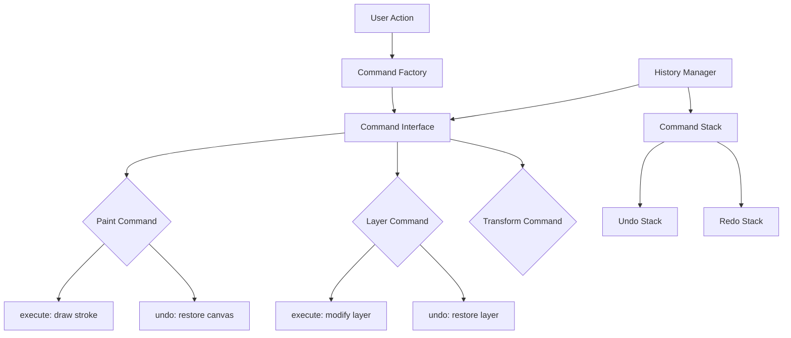

# Phase 3: History System Enhancements - Detailed Plan

## Overview

This document outlines the detailed plan for Phase 3 improvements to the history (undo/redo) system.

## Current State (After Phases 1-2)

- ✅ Brush/Pencil/Eraser tools now work with undo/redo
- ✅ History limit enforced (50 entries default)
- ✅ Labels detect paint strokes correctly
- ❌ Still using full canvas snapshots (memory intensive)
- ❌ No operation grouping (each stroke = separate undo)
- ❌ Preferences dialog not connected to actual settings

---

## Phase 3A: Quick Improvements (Low Effort)

### 3A.1: Connect Preferences to Actual Settings

**Problem**: The preferences dialog has history settings but they're not wired up.

**Solution**: 
- Store maxHistoryEntries in localStorage
- Load and use in EditorContext

**Files to modify**:
- `src/components/EditorContext.tsx` - Load from localStorage
- `src/components/PreferencesDialog.tsx` - Save to localStorage

**Implementation**:
```typescript
const STORAGE_KEY = 'shrimp_preferences';

const loadPrefs = (): Partial<PrefsState> => {
    try {
        const stored = localStorage.getItem(STORAGE_KEY);
        return stored ? JSON.parse(stored) : {};
    } catch { return {}; }
};

const savePrefs = (prefs: PrefsState) => {
    localStorage.setItem(STORAGE_KEY, JSON.stringify(prefs));
};
```

### 3A.2: Add Operation Grouping for Brush Strokes

**Problem**: Each brush stroke creates a separate undo entry.

**Solution**: 
- Allow grouping multiple strokes into one undo
- Use Shift+drag to group strokes

**Implementation**:
```typescript
// In Canvas.tsx - add stroke batching
const strokeBatch = useRef<HTMLCanvasElement[]>([]);

const endStrokeBatch = () => {
    if (strokeBatch.current.length > 0) {
        // Merge all canvases in batch and push as single entry
        const merged = mergeCanvases(strokeBatch.current);
        updateLayerData(activeLayerId, merged, true);
        strokeBatch.current = [];
    }
};
```

---

## Phase 3B: Performance Optimizations (Medium Effort)

### 3B.1: Lazy Canvas Cloning

**Problem**: Canvas cloning happens on every action, even if not needed.

**Solution**: 
- Don't clone canvas immediately when pushing to history
- Clone only when undo is actually triggered

**Implementation**:
```typescript
// Store reference + timestamp instead of full clone
interface LazyHistoryEntry {
    content: EditorContent;
    canvasRefs: Map<string, HTMLCanvasElement>;
    timestamp: number;
}

// On undo - clone the canvas at that point
const performUndo = () => {
    // Clone canvases only when needed
    const clonedContent = deepCloneForUndo(entry.content);
    // ... restore
};
```

**Benefits**:
- Faster for normal editing (no clone overhead)
- Memory savings if user never undoes

### 3B.2: Incremental Canvas Diffs

**Problem**: Full canvas copy even for small changes.

**Solution**: 
- Store only the changed regions
- Merge regions on undo

**Implementation**:
```typescript
interface CanvasDiff {
    layerId: string;
    x: number;
    y: number;
    width: number;
    height: number;
    imageData: ImageData;
}

// Store diff instead of full canvas
const historyEntry = {
    type: 'canvas_diff',
    diffs: CanvasDiff[]
};
```

---

## Phase 3C: Command Pattern Redesign (High Effort, Long-Term)

### Overview

Replace the current snapshot-based system with a proper command pattern.

### Architecture



### Command Interface

```typescript
interface Command {
    id: string;
    description: string;
    timestamp: number;
    
    execute(): void;
    undo(): void;
    redo(): void;
    
    // For merging
    canMergeWith(other: Command): boolean;
    mergeWith(other: Command): Command;
}

// Example implementations
class PaintStrokeCommand implements Command {
    constructor(
        public layerId: string,
        public strokeData: StrokeData
    ) {}
    
    execute() { /* draw stroke */ }
    undo() { /* restore previous canvas state */ }
    redo() { /* re-execute */ }
}

class LayerAddCommand implements Command {
    execute() { /* add layer */ }
    undo() { /* remove layer */ }
}
```

### History Manager

```typescript
class HistoryManager {
    private commands: Command[] = [];
    private currentIndex: number = -1;
    private maxCommands: number = 50;
    
    execute(command: Command): void {
        // Remove any commands after current index
        this.commands = this.commands.slice(0, this.currentIndex + 1);
        
        // Merge if possible
        const lastCommand = this.commands[this.currentIndex];
        if (lastCommand?.canMergeWith(command)) {
            command = lastCommand.mergeWith(command);
            this.commands[this.currentIndex] = command;
        } else {
            this.commands.push(command);
            this.currentIndex++;
        }
        
        // Trim if over limit
        if (this.commands.length > this.maxCommands) {
            this.commands = this.commands.slice(-this.maxCommands);
            this.currentIndex = this.commands.length - 1;
        }
        
        command.execute();
    }
    
    undo(): void {
        if (this.currentIndex < 0) return;
        this.commands[this.currentIndex].undo();
        this.currentIndex--;
    }
    
    redo(): void {
        if (this.currentIndex >= this.commands.length - 1) return;
        this.currentIndex++;
        this.commands[this.currentIndex].redo();
    }
}
```

### Benefits of Command Pattern

1. **Memory Efficient**: Store commands, not full snapshots
2. **Flexible**: Easy to implement complex undo logic
3. **Composable**: Commands can merge (e.g., multiple brush strokes)
4. **Extensible**: New commands easy to add

### Migration Path

1. **Phase 1**: Wrap existing operations in commands
2. **Phase 2**: Add command merging for brush strokes
3. **Phase 3**: Remove old snapshot system

---

## Recommended Priority Order

| Priority | Task | Effort | Impact |
|----------|------|--------|--------|
| 1 | Connect preferences to settings | Low | Medium |
| 2 | Operation grouping for brush | Low | High |
| 3 | Lazy canvas cloning | Medium | High |
| 4 | Command pattern redesign | High | Very High |

---

## Questions for Decision

1. **Should we prioritize performance or features first?**
   - Performance: Implement lazy cloning
   - Features: Implement operation grouping

2. **Is the command pattern worth the effort?**
   - Pros: Most flexible, professional-grade solution
   - Cons: Significant refactoring

3. **Timeline expectations?**
   - Quick wins: Can be done in current sprint
   - Command pattern: Consider for v2.0
