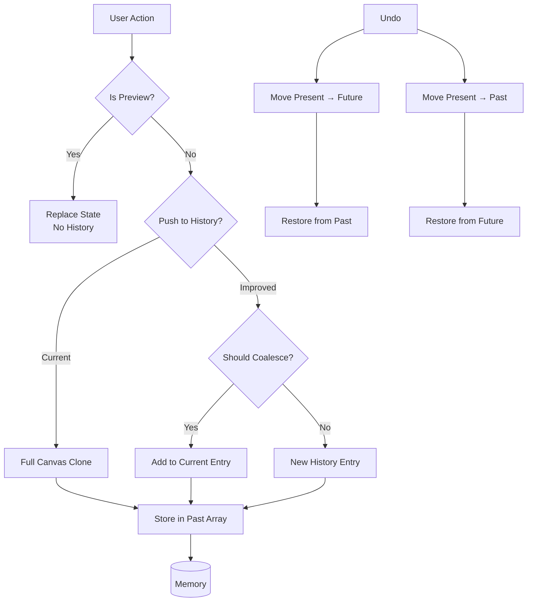

# Deep Analysis: History (Undo/Redo) System

## Current Architecture Overview

### Core Data Structures

```typescript
// HistoryState - The fundamental history structure
interface HistoryState<T> {
    past: T[]      // Array of previous states
    present: T     // Current state
    future: T[]    // Array of future states (after redo)
}

// EditorContent - What's being stored in history
interface EditorContent {
    layers: Layer[]
    activeLayerId: string | null
    canvasSize: { width: number; height: number }
    selection: Selection | null
    guides: Guide[]
    paths: VectorPath[]
    activePathId: string | null
}

// Document - Contains the history
interface Document {
    id: string
    name: string
    history: HistoryState<EditorContent>
}
```

### History Operations

1. **Push to History** (`updateState`/`modifyContent` with mode='push'):
   - Current state moves to `past` array
   - New state becomes `present`
   - `future` array is cleared

2. **Replace** (`replaceState`/`modifyContent` with mode='replace'):
   - Only updates `present` without affecting past/future
   - Used for transient updates (live preview)

3. **Undo**: Moves `present` to `future`, restores previous from `past`

4. **Redo**: Moves `present` to `past`, restores from `future`

5. **History Jump**: Allows jumping to any point in history

## Current Implementation Strengths

### 1. **Clean Separation of Concerns**
- History state is properly isolated in `HistoryState<T>` type
- Past/present/future are clearly separated

### 2. **Two History Modes**
- `push` mode for new actions (default)
- `replace` mode for live preview updates
- This prevents flooding history with every mouse move

### 3. **History Jump Support**
- `restoreHistoryIndex` allows jumping to any point
- UI shows history log with ability to restore states

### 4. **Automatic Label Generation**
- `labelFor` function generates human-readable labels
- Detects layer adds/deletes, crop, path changes, etc.

### 5. **Integration with Persistence**
- Auto-save after 2 seconds of inactivity (line 341-343)

## Current Limitations & Issues

### 1. **Full State Snapshots - Memory Intensive**

**Problem**: Every history entry stores a complete `EditorContent` object, including:
- All layer canvases (potentially huge)
- All layer metadata
- Paths, selections, guides

**Impact**:
- Memory usage grows linearly with history size
- Large canvases (e.g., 4K images) with many undo levels can consume gigabytes
- The preferences dialog already hints at this (line 59-62: `maxUndoMemory: 2083269` bytes ≈ 2MB default)

### 2. **Canvas Cloning Performance**

**Problem**: Current approach clones entire canvas on every action:
```typescript
const newCanvas = document.createElement('canvas')
newCanvas.width = sourceCanvas.width
newCanvas.height = sourceCanvas.height
newCtx?.drawImage(sourceCanvas, 0, 0)
```

**Impact**:
- Every brush stroke, shape, or filter creates a full canvas copy
- Large canvases cause noticeable lag
- Even with the fix, performance remains a concern

### 3. **No Granular History for Operations**

**Problem**: All operations are treated equally:
- A single brush stroke = 1 history entry ✓
- But drawing 10 strokes = 10 history entries
- No way to "group" related operations

**Impact**:
- Undo undoes one stroke at a time (can be tedious)
- No concept of "compound operations" (e.g., "Undo entire filter application")

### 4. **History Label Detection is Limited**

**Problem**: The `labelFor` function (lines 708-750) only detects:
- Canvas size changes (crop)
- Layer count changes
- Active layer changes
- Path count/changes

**Missing**:
- Brush stroke descriptions
- Filter names
- Transform operations
- Color/blend mode changes

### 5. **No Coalescing for Rapid Actions**

**Problem**: Rapid actions (e.g., holding down brush) create many history entries:
- Each `handleMouseUp` creates a new entry
- No debouncing or coalescing

### 6. **No Throttling/Compression**

**Problem**: No limit on history size:
- `past` array can grow indefinitely
- Preferences mention `undoLevels: 5` but it's not enforced

### 7. **History Entry Metadata Missing**

**Problem**: Each history entry is just `EditorContent` with no metadata:
- No timestamp
- No operation type
- No description
- Cannot distinguish "added layer" from "drew brush"

### 8. **Undo/Redo for Non-Canvas State**

**Problem**: Some state is not in history:
- `foregroundColor` / `backgroundColor` (line 484-485: "not tracked in history")
- View transform (zoom, pan)
- Active tool
- Panel state

### 9. **Deep Clone Complexity**

**Problem**: The history system relies on shallow copies with mutated objects:
- Layer canvas references are shared (caused the original bug)
- Need to ensure deep cloning for canvas data

## Proposed Improvements

### Phase 1: Quick Wins (Low Effort, High Impact)

#### 1.1 Enforce History Limits

```typescript
const MAX_HISTORY_ENTRIES = 50; // Configurable

// In modifyContent:
if (historyMode === 'push') {
    const newPast = [...past, current].slice(-MAX_HISTORY_ENTRIES);
    // ... rest of logic
}
```

#### 1.2 Improve Label Detection

Add detection for more operations:
```typescript
const labelFor = (prev, next): string => {
    // ... existing checks ...
    
    // Detect brush/pencil/eraser strokes
    const prevLayerData = getTotalPixels(prev);
    const nextLayerData = getTotalPixels(next);
    if (nextLayerData !== prevLayerData) {
        return 'Paint stroke';
    }
    
    // Detect filter changes
    if (prev.filters.length !== next.filters.length) {
        return 'Filter applied';
    }
    
    // ... etc.
}
```

#### 1.3 Add Operation Metadata

Enhance history entries:
```typescript
interface HistoryEntry {
    content: EditorContent;
    timestamp: number;
    operationType: 'paint' | 'layer' | 'transform' | 'filter' | 'etc';
    description: string;
}
```

### Phase 2: Architectural Improvements (Medium Effort)

#### 2.1 Implement Delta-Based History

Instead of full snapshots, store only the changes:

```typescript
interface HistoryDelta {
    type: 'layer_update' | 'layer_add' | 'layer_delete' | 'paint_stroke';
    layerId?: string;
    // For paint strokes - could store path data instead of full canvas
    strokeData?: {
        points: Array<{x, y, pressure}>;
        color: string;
        size: number;
    };
    // For full layer data (backup)
    fullBackup?: HTMLCanvasElement;
}
```

**Pros**: Dramatically reduced memory for paint operations
**Cons**: Replay complexity; need to handle edge cases

#### 2.2 Lazy Canvas Cloning

Only clone canvas when needed for undo:
- Keep reference during active session
- Clone only when user performs undo or history jump

```typescript
// In modifyContent:
if (historyMode === 'push') {
    // Don't clone immediately - just store reference
    // Clone on-demand when undo is triggered
    const historyEntry = {
        content: { ...newContent }, // Shallow copy
        _lazyCanvases: layerCanvases // References
    };
}
```

#### 2.3 Operation Grouping

Allow grouping multiple actions into one undo:

```typescript
const startOperationGroup = () => {
    // Start buffering
};

const endOperationGroup = () => {
    // Push entire group as single history entry
};

// Usage: Hold Shift while drawing to group strokes
```

### Phase 3: Complete Rebuild (High Effort)

#### 3.1 Command Pattern

Implement a proper command pattern:

```typescript
interface Command {
    execute(): void;
    undo(): void;
    description: string;
}

// Example:
class PaintStrokeCommand implements Command {
    constructor(layerId, strokeData) { }
    
    execute() {
        // Apply stroke to canvas
    }
    
    undo() {
        // Restore previous canvas state
    }
}

class HistoryManager {
    private commands: Command[] = [];
    private currentIndex: number = -1;
    
    execute(command: Command) {
        command.execute();
        this.commands = this.commands.slice(0, this.currentIndex + 1);
        this.commands.push(command);
        this.currentIndex++;
    }
    
    undo() {
        this.commands[this.currentIndex--].undo();
    }
    
    redo() {
        this.commands[++this.currentIndex].execute();
    }
}
```

**Pros**:
- Most flexible and powerful
- Easy to implement complex undo logic
- Natural fit for editor operations

**Cons**:
- Significant refactoring required
- Need to convert all existing operations

#### 3.2 Event-Sourced Architecture

Store all operations as events that can be replayed:

```typescript
interface Event {
    type: string;
    timestamp: number;
    payload: any;
}

// Events:
// - LayerCreated
// - LayerDeleted
// - PaintStrokeApplied
// - FilterApplied
// - TransformChanged

// To undo: apply inverse events
// To redo: replay events
```

**Pros**: Very memory efficient, great for collaboration
**Cons**: Complex to implement, replay performance concerns

## Recommended Approach

Given the current codebase state, I recommend:

### Option A: Incremental Improvements (Recommended)

Continue with current architecture but add:

1. **History limits** - Prevent unbounded growth
2. **Better labels** - More descriptive history log
3. **Operation batching** - Group rapid actions
4. **Lazy cloning** - Defer canvas copying

This is low-risk and provides immediate benefits.

### Option B: Command Pattern (For Long-Term)

If the team wants a complete rebuild, the Command Pattern is the best approach:
- Well-understood pattern
- Maps well to editor operations
- Can be implemented incrementally

## Implementation Priority

1. **Immediate** (in progress):
   - ✅ Canvas cloning fix (DONE)

2. **This Sprint**:
   - Add history limits
   - Improve label detection for brush strokes

3. **Next Sprint**:
   - Operation batching for brush strokes
   - Add operation metadata to history

4. **Future**:
   - Consider Command Pattern for v2
   - Delta-based history for memory optimization

## Mermaid Diagram: Current vs Improved Architecture


